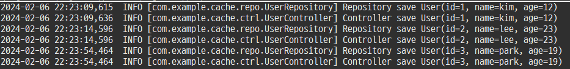
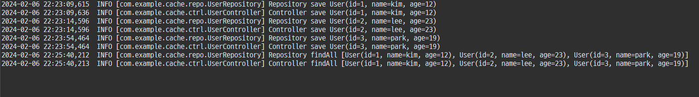
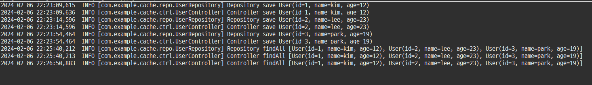
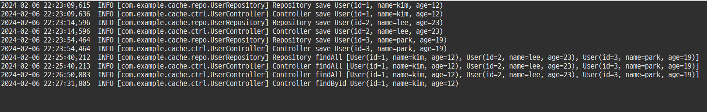
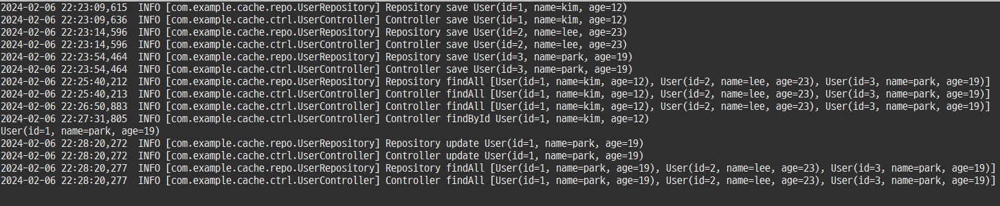

## 캐시(Cache)
---

캐시는 자주 사용하는 데이터나 값을 미리 복사해 놓는 임시 장소를 가리킨다. 동일한 요청이 들어오면 작업을 수행해서 결과를 만드는 대신 이미 보관된 결과를 돌려주는 방식을 말합니다.

> 출처 : https://mangkyu.tistory.com/69

캐시는 저장 공간이 작고 비용이 비싸지만 빠른 성능을 제공합니다. 하지만 저장공간이 작고 비용이 비싼만큼 모든 상황에서 쓸 수 있는 것은 아니다. 아래와 같은 경우에 사용을 고려하면 좋다.

-  반복적으로 동일한 결과를 돌려주는 작업 (이미지, 썸네일, 실시간 검색어 등)
-  잘 바뀌지 않는 정보를 외부에서 반복적으로 읽어오는 경우 (DB 데이터 호출 및 API 호출)

캐시는 메모리에 데이터를 저장하였다가 불러 사용한다. 엔터프라이즈급 어플리케이션에서 DBMS의 부하를 줄이고, 시간이 오래 걸리는 작업들에 대해 성능을 높일 수 있습니다. 캐시의 데이터가 변하는 시점에 맞춰 전략적으로 캐시를 사용하면 된다.

캐시는 오로지 성능을 위해서 자리를 잡고 있는 것이기 때문에 다른 것에 영향을 미쳐서는 안 된다. 다른 데이터가 바뀌어 버린다면 또 다른 비즈니스 로직이 되어버린다. 오로지 성능만을 위하기 때문에 다른 것에 영향을 미치지 않는다는 의미로 "투명하다"라는 말을 쓴다고 합니다.

## 테스트

### 1. 새로운 유저 추가

3명의 유저를 추가합니다. 데이터 추가와 변경은 @CachePut을 사용하므로 매번 Repository 로그를 남깁니다. user::id 키값으로 해당 데이터를 캐싱합니다.

### 2. 첫 리스트 조회

첫 리스트 조회입니다. 캐싱된 데이터가 없으므로 Repository 로그를 남깁니다. user::all 키값으로 해당 데이터를 캐싱합니다.

### 3. 두번째 리스트 조회

두번째 리스트 조회입니다. user::all 키값으로 이미 데이터가 저장되어 있으므로 Repository 로그를 남기지 않습니다.

### 4. 유저 상세 조회

해당 유저의 상세 조회입니다. 유저 추가 과정에서 @CachePut 으로 user::1 가 이미 캐싱되어 있으므로 Repository 로그를 남기지 않습니다.

### 5. 유저 업데이트 후 조회

유저 업데이트 과정에서 members::all 이 evict 되어 다시 리스트 조회 Repository 까지 수행하게되어 로그를 남기게 됩니다.
